WIP 🚧 🏗  pre spellcheck

Hello 👋 

After setting/reinstalling a couple of machines from scratch in the last few months, I decided for once and for all to document my default data science settings and tools I typically used. 

💡 **A pro tip** 👉🏼 avoid dropping a cup of ☕️ on your machine 🤦🏻‍♂️

That includes installing programming languages such as Python 🐍 and R. In addition, setting up the terminal, git, and install supporting tools such as iTerm2, oh-my-zsh, Docker 🐳, etc. 


**Last Update:** January 1st, 2025


**Update:** This setting is up-to-date with [macOS Sequoia](https://www.apple.com/macos/macos-sequoia/) ❤️. However, most of the tools in this document should be OS agnostic (e.g., Windows, Linux, etc.) with some minor modifications.

This document covers the following:
- [Setting Git and SSH](https://github.com/RamiKrispin/awesome-ds-setting/blob/main/README.md#setting-git-and-ssh)
- [Install Command Lines Tools](https://github.com/RamiKrispin/awesome-ds-setting/blob/main/README.md#install-command-lines-tools)
- [Install Docker](https://github.com/RamiKrispin/awesome-ds-setting/blob/main/README.md#install-docker)
- [Setting Terminal](https://github.com/RamiKrispin/awesome-ds-setting#terminal-setting)
- [Setting VScode](https://github.com/RamiKrispin/awesome-ds-setting#setting-vscode)
- [Setting Python](https://github.com/RamiKrispin/awesome-ds-setting#setting-python)
- [Install R and RStudio](https://github.com/RamiKrispin/awesome-ds-setting/blob/main/README.md#install-r-and-rstudio)
- [Shortcuts](https://github.com/RamiKrispin/awesome-ds-setting/blob/main/README.md#shortcuts)
- [Setting Postgres](https://github.com/RamiKrispin/awesome-ds-setting#setting-postgres)


## Set Git and SSH

This section focuses on the core git settings, such as global definitions and setting SSH with your Github account.

All the settings in the sections are done through the command line (unless mentioned otherwise).

Let's start by checking the `git` version running the following:

``` shell
git --version
```

If this is a new computer or you did not set it before, it should prompt a window and ask you if you want to install the `command line developer tools`:


The `command line developer tools` is required to run git commands. Once installed, we can go back to the terminal and set the global git settings.

### Set Git global options

Git enables setting both local and global options. The global options will be used as default settings any time triggering a new repository with the `git init` command. You can override the global settings on specific repo by using local settings. Below, we will define the following global settings:

- Git user name
- Git user email
- Default branch name
- Global git ignore file
- Default editor (for merging comments)

### Set git user name and email

Setting global user name and email by using the `config --global` command:
``` shell
git config --global user.name "USER_NAME"
git config --global user.email "YOUR_EAMIL@example.com"
```
### Set default branch name

Next, let's set the default branch name as `main` using the `init.defaultBranch` argument:

``` shell
git config --global init.defaultBranch main
```

### Set global Git ignore file

The global `.gitignore` file enables you to set general ignore roles that will apply automatically to all repositories in your machine. This is useful when having repetitive cases of files you wish to ignore by default. A good example on Mac is the system file -.DS_Store, which is auto-generated on each folder, and you probably do not want to commit it. First, let's create the global `.gitignore` file using the `touch` command:

``` shell
touch ~/.gitignore
```

Next, let's define this file as global:

``` shell
git config --global core.excludesFile ~/.gitignore
```

Once the global ignore file is set, we can start adding the files we want git to ignore systematically. For example, let's add the `.DS_Store` to the global ignore file:

``` shell 
echo .DS_Store >> ~/.gitignore
```
**Note:** You want to be careful about the files you add to the global ignore file. Unless it is applicable to all cases, such as the .DS_Store example, you should not add it to the global settings and define it locally to avoid a git disaster.

### Set default editor

Git enables you to set the default shell code editor to create and edit your commit messages with the `core.editor` argument. Git supports the main command line editors such as `vim`, `emacs`, `nano`, etc. I set main as `vim`:

``` shell
git config --global core.editor "vim"
```

### Review and modify global config settins

By default, all the global settins saved to the `config` file under the `.ssh` folder. You can review the saved settings, modify and add new ones manually by editing the `config` file:


``` shell
vim ~/.gitconfig
```


### Set SSH with Github

Setting `SSH` key required to sync your local git repositories with the `origin`. By default, when creating the SSH keys it writes the files under the `.ssh` folder, if exists, otherwise it writes it down under the root folder. It is more "clean" to have it under the `.ssh` folder, therefore, my settings below assume this folder exists. 

Let's start by creating the `.ssh` folder:

``` shell
mkdir ~/.ssh
```

The `ssh-keyget` command creates the SSH keys files:

To set SSH key on your local machine you need to use `ssh-keyget`:

``` shell
ssh-keygen -t ed25519 -C "YOUR_EAMIL@example.com"
```
**Note:** The `-t` argument defines the algorithm type for the authentication key, in this case I used `ed25519` and the `-C` argument enables adding comment,in this case the user name email for reference.

After runngint the `ssh-keygen` command, it will prompt for setting file name and password (optional). By default it will save it under the root folder. 

**Note:** this process will generate two files:
- `your_ssh_key` is the private key, you should not expose it
- `your_ssh_key.pub` is the public key which will be used to to set the SSH on Github

The next step is to register the key on your Github account. On your account main page go to the `Settings` menu and select on the main menu `SSH and GPG keys` (purple rectangle 👇🏼) and click on the `New SSH key` (yellow rectangle 👇🏼):

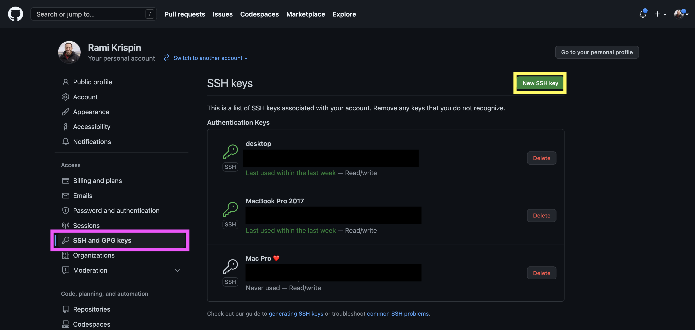


Next, set the key name under the title text box (purple rectangle 👇🏼), and paste your public key to the `key` box (turquoise rectangle 👇🏼):

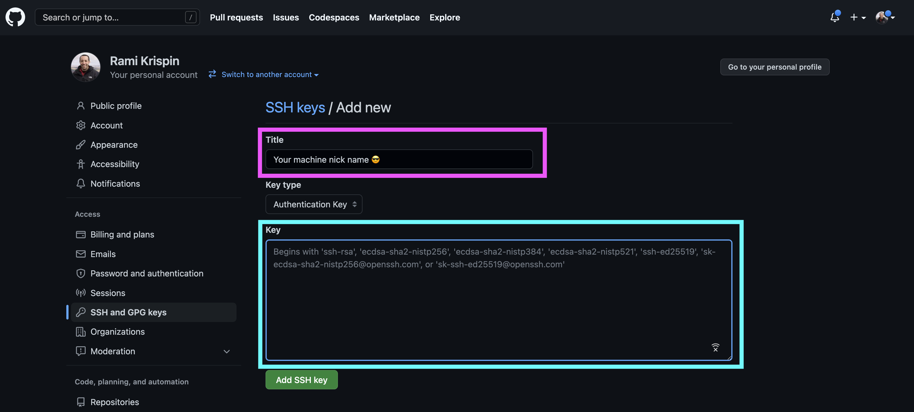

**Note:** I set the machine nickname (e.g., MacBook Pro 2017, Mac Pro, etc.) as the key title to easily identify the relevant key in the future.

Next step is to update the `config` file on the `~/.ssh` folder. You can edit the `config` file with `vim`:

``` shell
vim ~/.ssh/config 
```

and add somewhere on the file the following code:

``` shell
Host *
  AddKeysToAgent yes
  UseKeychain yes
  IdentityFile ~/.ssh/your_ssh_key
```
Where `your_ssh_key` is the private key file name


Last, run the following to load the key:
```
ssh-add --apple-use-keychain ~/.ssh/your_ssh_key
```

### Resources

- Github documentation - https://docs.github.com/en/enterprise-server@3.0/authentication/connecting-to-github-with-ssh/adding-a-new-ssh-key-to-your-github-account
- `ssh-keyget` arguments -  https://www.ssh.com/academy/ssh/keygen
- A great video toturial about setting SSH:  https://www.youtube.com/watch?v=RGOj5yH7evk&t=1230s&ab_channel=freeCodeCamp.org
- Setting Git ignore - https://www.atlassian.com/git/tutorials/saving-changes/gitignore
- Initial Git setup - https://git-scm.com/book/en/v2/Getting-Started-First-Time-Git-Setup

## Install Command Lines Tools

This section covers core command lines tools.

### Homebrew

The Homebrew (or `brew`) enables you to install CL packages and tools for Mac. To install `brew` run from the terminal:

```shell
/bin/bash -c "$(curl -fsSL https://raw.githubusercontent.com/Homebrew/install/HEAD/install.sh)"
```

After finishing the installation, you may need to run the following commends (follow the instractions at the end of the installation):

``` shell
(echo; echo ‘eval “$(/opt/homebrew/bin/brew shellenv)“’) >> /Users/USER_NAME/.zprofile
eval “$(/opt/homebrew/bin/brew shellenv)”
```


More info available: https://brew.sh/

### jq

The `jq` is a lightweight and flexible command-line JSON processor. You can install it with `brew`:

```shell
brew install jq
```

### Install Docker

To spin a VM locally to run Docker we will set [Docker Desktop](https://www.docker.com/products/docker-desktop).


#### Install Docker Desktop

Go to [Docker website](https://docs.docker.com/get-started/get-docker/) and follow the intallation instractions according to your OS:

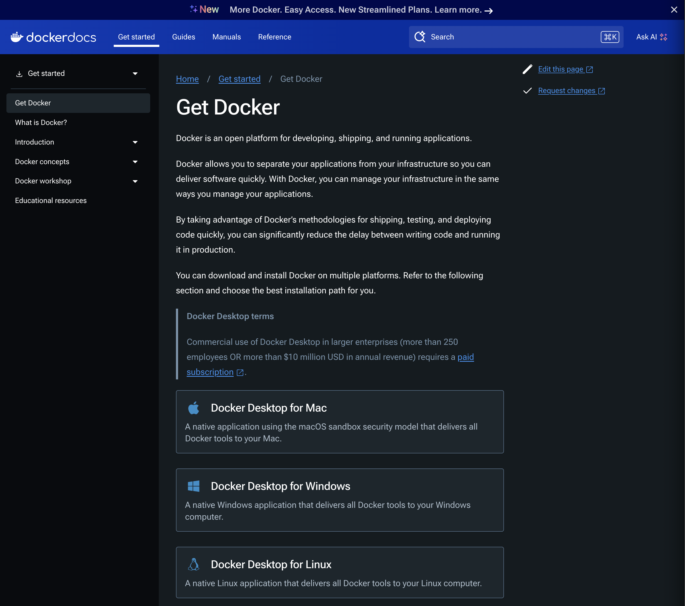</a>


**Note:** Docker Desktop required license

### Set Up Terminal 

This section focuses on installing and setting tools for working on the terminal. 

#### Install iTerm2

The `terminal` is the built-in emulator on mac. I personally love to work with `iTerm2` as it provides additional functionality and customization options. iTerm2 is available only for mac, and can be installed directly from the [iTerm2](https://iterm2.com/) website or via `homebrew`:

``` shell
> brew install --cask iterm2
.
.
.
==> Installing Cask iterm2
==> Moving App 'iTerm.app' to '/Applications/iTerm.app'
🍺  iterm2 was successfully installed!
```

#### Install zsh

The next step is to install Z shell or `zsh`. The `zsh` is shell flavor built on top of `bash`, providing a variety of add-in tools on the terminal. We will use `homebrew` again to install `zsh`:

``` shell
> brew install zsh
.
.
.
==> Installing zsh
==> Pouring zsh--5.8_1.monterey.bottle.tar.gz
🍺  /usr/local/Cellar/zsh/5.8_1: 1,531 files, 14.7MB
```

#### Install and Set Oh-My-Zsh

After installing the `zsh` we will install `oh-my-zsh`, an open-source framework for managing `zsh` configuration. We wiil install it with the `curl` command:

``` shell
 sh -c "$(curl -fsSL https://raw.githubusercontent.com/ohmyzsh/ohmyzsh/master/tools/install.sh)"
```

You can note that your terminal view changed (you may need to reset your terminal to see the changes) and the default command line cursor looks like:

``` zsh
➜  ~
```

The default setting of `Oh My Zsh` stored on `~/.zshrc` and you can modify the default theme by editing the file:

```
vim ~/.zshrc
```

I use the `powerlevel10k` which can be install by cloning the Github repository (for `oh-my-zsh`):

``` zsh
git clone --depth=1 https://github.com/romkatv/powerlevel10k.git ${ZSH_CUSTOM:-$HOME/.oh-my-zsh/custom}/themes/powerlevel10k
```

And then change the theme setting on the `~/.zshrc` by `ZSH_THEME="powerlevel10k/powerlevel10k"`. After restarting the terminal, and reopening it you will a sequence of questions on that enables you to set the theme setting:

``` zsh

                            Install Meslo Nerd Font?

(y)  Yes (recommended).

(n)  No. Use the current font.

(q)  Quit and do nothing.

Choice [ynq]:
```

**Note:** the `Meslo Nerd` font is required to display symbles that is being used by the  `powerlevel10k` theme

You can always modify your selection by using:

``` zsh
 p10k configure
 ```
 
 The terminal after adding the `powerlevel10k` theme looks like:
 
 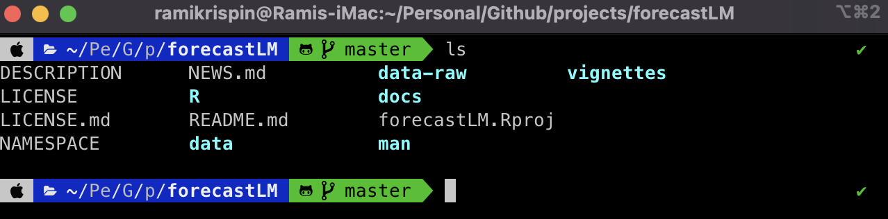</a>

Installing `zsh-syntax-highlighting` to add code highlight on the terminal:

``` zsh
brew install zsh-syntax-highlighting
```

After the installation is done you will need to clone the source code. I set the destination as home folder, defining the traget folder hidden:

``` zsh
git clone https://github.com/zsh-users/zsh-syntax-highlighting.git $HOME/.zsh-syntax-highlighting
echo "source $HOME/.zsh-syntax-highlighting/zsh-syntax-highlighting.zsh" >> ${ZDOTDIR:-$HOME}/.zshrc
```

After you reset your terminal, you should see be able to see the syntex highlight in green (in my case):

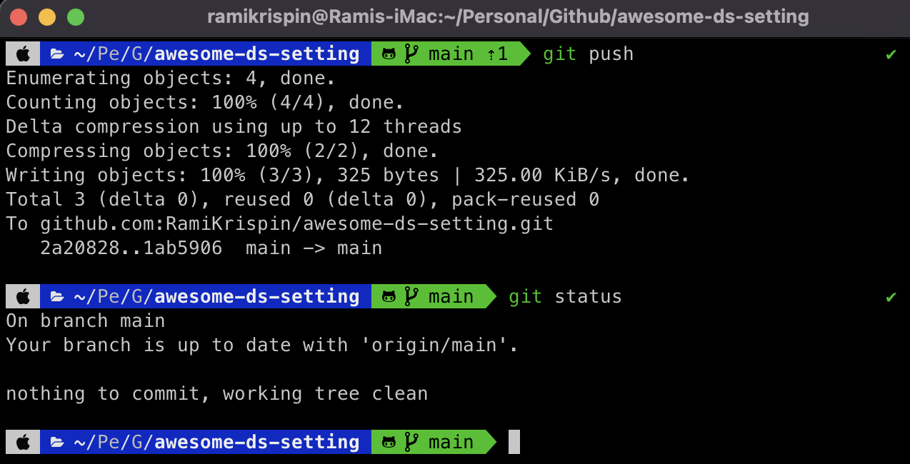</a>


### Resources
- `iTerm2` - https://iterm2.com/index.html
- `oh my zsh` - https://ohmyz.sh/
- freeCodeCamp blog post - https://www.freecodecamp.org/news/how-to-configure-your-macos-terminal-with-zsh-like-a-pro-c0ab3f3c1156/
- `powerlevel10k` theme - https://github.com/romkatv/powerlevel10k
- `zsh-syntax-highlighting` - https://github.com/zsh-users/zsh-syntax-highlighting/blob/master/INSTALL.md#in-your-zshrc

## Install VScode

VScode is a general-purpose IDE and my favorite development environment. VScode supports mutliple OS such as Lunix, MacOS, Windows, and Raspberry Pi. 

Installing VScode is straightforward - go to the VScode website  https://code.visualstudio.com/ and click on the Download button (purple rectangle 👇🏼):
</a>

Download the installation file and follow the instructions. 

## Set Up Python

This section focuses on setting up tools for working with Python locally (without Docker container) with UV and miniconda. If you are intrested in setting up a dockerized Python/R development environment with VScode, Docker, and the Dev Containers extension, please check out the following tutorials:
- Python - https://github.com/RamiKrispin/vscode-python
- R - https://github.com/RamiKrispin/vscode-r

Also, you can leverage the following VScode templates:
- Python (using venv) - https://github.com/RamiKrispin/vscode-python-template
- Python (using uv) - https://github.com/RamiKrispin/vscode-python-uv-template
- R - https://github.com/RamiKrispin/vscode-r-template

### Install UV

UV is an extremely fast Python package and project manager, written in Rust. Installing UV is straightforward and I recommend checking the project [documentation](https://docs.astral.sh/uv/getting-started/installation/#__tabbed_1_1).

On Mac and Linux you can use `curl`:
```shell
curl -LsSf https://astral.sh/uv/install.sh | sh
```
or with `wget`:
```shell
wget -qO- https://astral.sh/uv/install.sh | sh
```

On Windows using `powershell`:
```shell
powershell -ExecutionPolicy ByPass -c "irm https://astral.sh/uv/install.ps1 | iex"
```


### Install miniconda

Miniconda is an alternative tool to set up local Python environments. Go to the Miniconda installer [page](https://docs.conda.io/en/latest/miniconda.html#latest-miniconda-installer-links) and download the installing package based on your operating system and Python version to install the most recent version. Once Miniconda installed you can install Python packaes with `conda`:

``` shell
conda install pandas
```

Likewise, you can use `conda` to create an environment:

```
conda create -n myenv python
```

#### Common conda commands

Get a list of environments:

``` shell
conda info --envs
```

Create an environment and set the Python version:

```
conda create --name myenv python=3.9
```

Get package available versions:

```
conda search pandas
```

Activate an enviroment:

``` sheel
conda activate myenv
```

Get a list of installed packages in the environment:

``` shell
conda list
```

Deactivate the enviroment:

```shell
conda deactivate
```


### Install Ruff

Ruff is an extremely fast Python linter and code formatter, written in Rust.

You can install Ruff directly from PyPi using `pip`:
```shell
pip install ruff
```
On Mac and Linux using `curl`:
```shell
curl -LsSf https://astral.sh/ruff/install.sh | sh
```
Likewise, on Windows using `powershell`:
```shell
powershell -c "irm https://astral.sh/ruff/install.ps1 | iex"
```

### Resources
- UV documentation - https://docs.astral.sh/uv/
- Miniconda - https://docs.anaconda.com/miniconda/
- Ruff documentation - https://docs.astral.sh/ruff/


## Install R and Positron

To set in your machine [R](https://cran.r-project.org/index.html) and [Positron](https://positron.posit.co/) you should start first with installing R from CRAN. Go to https://cran.r-project.org/ and select the relevent OS:

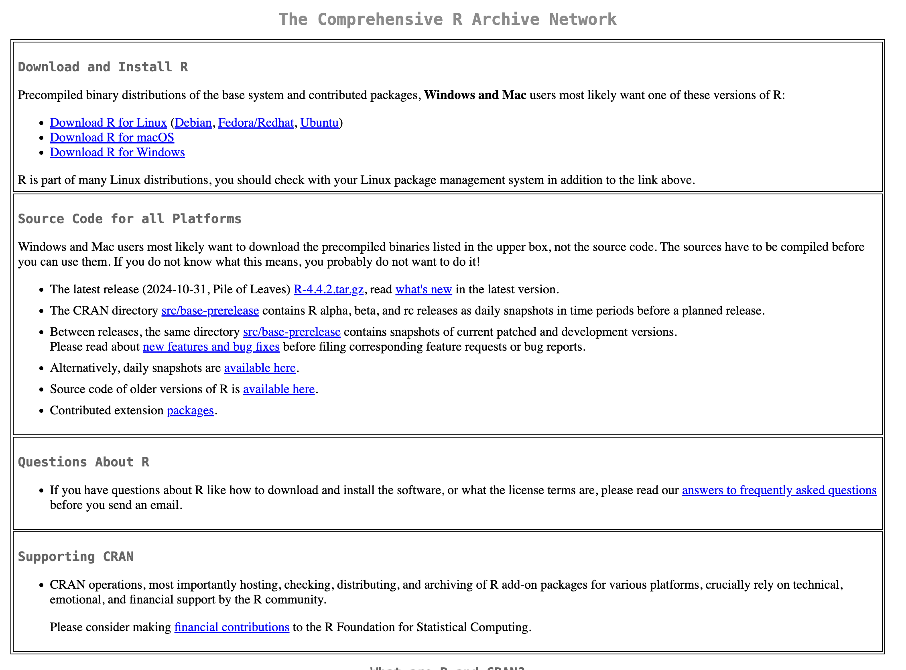</a>

**Note:** For macOS, there are two versions, depending on the type of your machine CPU - one for `Apple silicon arm64` and second for `Intel 64-bit`.

Once you finish to download the build you select open the `pkg` fild and start to install it:

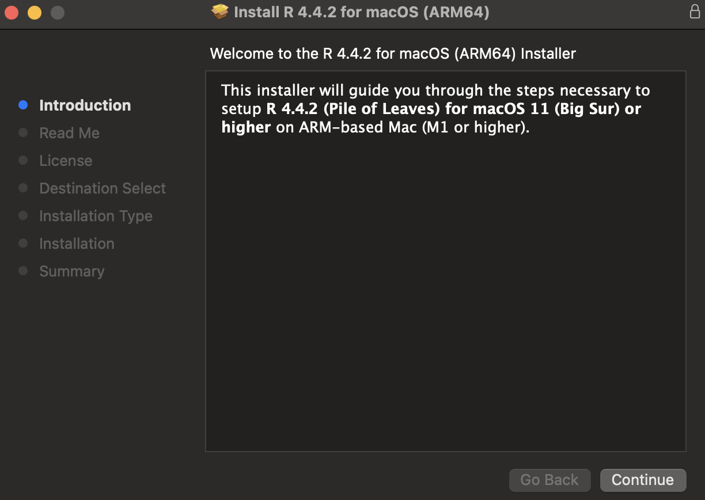</a>


**Note:** Older releases available on [CRAN Archive](https://cran-archive.r-project.org/bin/).

Once R installed, you can install Positron. Go to https://positron.posit.co/download.html and select the relevent OS version and download the relevent file:
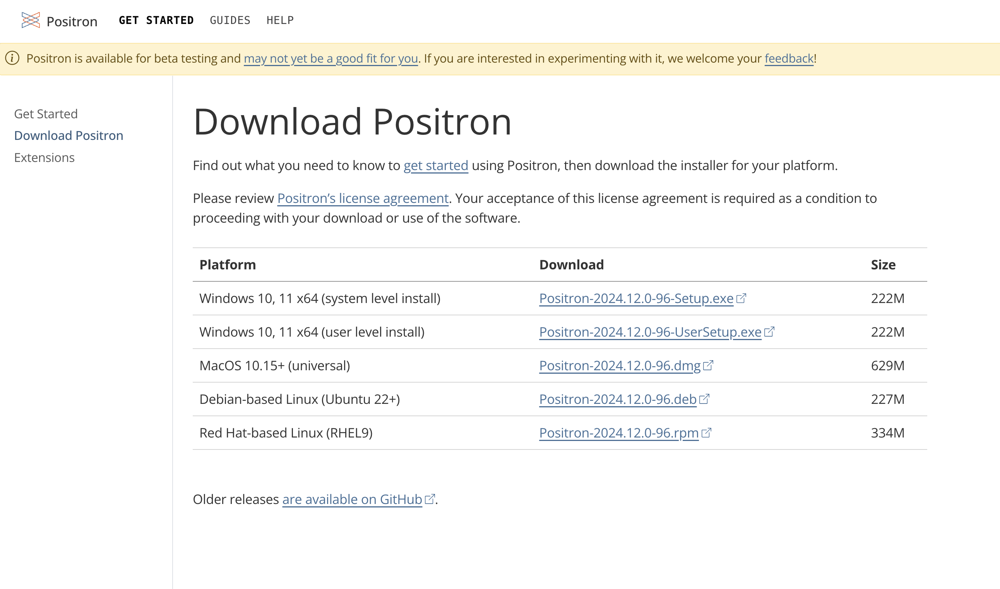</a>


After finish to download it move the application into the Application folder.

## Install Postgres

PostgreSQL supprts most of the common OS such as Windows, macOS, Linux, etc.

To download go to Postgres project [website](https://www.postgresql.org/) and navigate to the **Downlaod** tab and select your OS, which will naviage it to the OS download page, and follow the instraction:

 [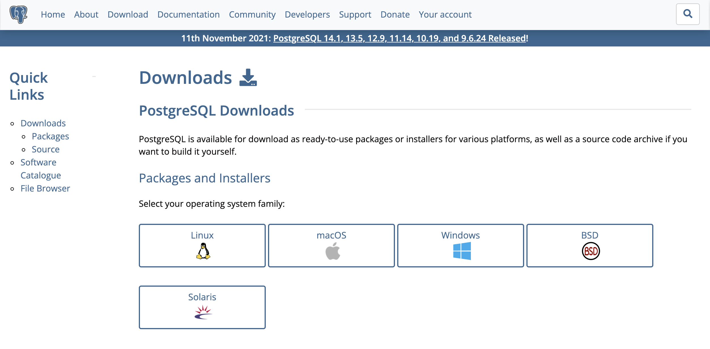</a>](https://www.postgresql.org/download/)


On mac I highly recommand to install PostgreSQL through the [Postgres.app](https://postgresapp.com/):

 [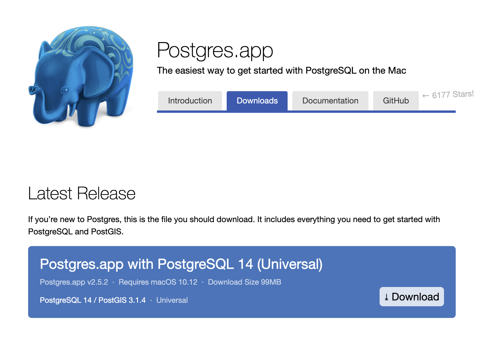</a>](https://postgresapp.com/)


When opening the app, you should have a default server set to port 5432 (make sure that this port is available):

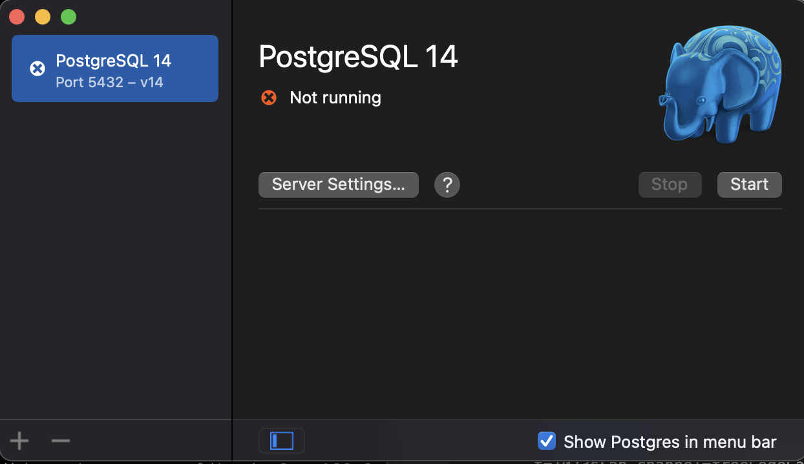</a>

To launch the server click on the `start` button:

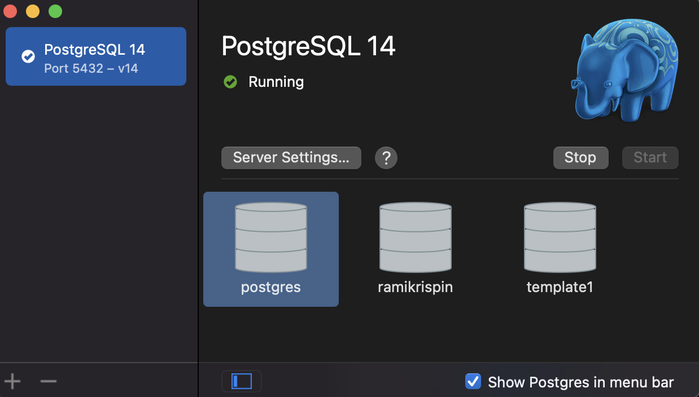</a>

By default, the server will create three databases - `postgres`, `YOUR_USER_NAME`, and `template1`. You can add additional server (or remove) by clicking the `+` or `-` symbols on the left botton.


To run Postgres from the terminal you will have to set define the path of the app on your `zshrc` file (on mac) by adding the following line:

``` zsh
export PATH=$PATH:/Applications/Postgres.app/Contents/Versions/14/bin/
```

Where `/Applications/Postgres.app/Contents/Versions/14/bin/` is the local path on my machine.

Alternativly, you can set the alias from the terminal by running the following"


``` zsh
echo "export PATH=$PATH:/Applications/Postgres.app/Contents/Versions/14/bin/" >> ${ZDOTDIR:-$HOME}/.zshrc
```


### Clear port

If the port you set for the Postgres server is in use you should expect to get the following message when trying to start the server:

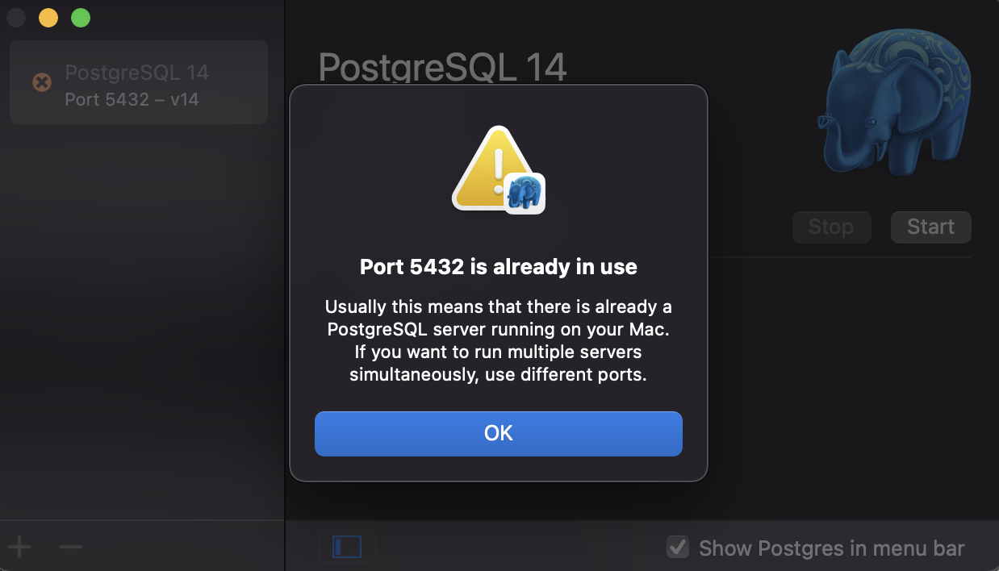</a>

This mean that the port is either used by other Postgres server or other application. To check what ports in use and by which applications you can use the `lsof` function on the terimnal:

``` zsh
sudo lsof -i :5432                                                                                           COMMAND  PID     USER   FD   TYPE             DEVICE SIZE/OFF NODE NAME
postgres 124 postgres    7u  IPv6 0xc250a5ea155736fb      0t0  TCP *:postgresql (LISTEN)
postgres 124 postgres    8u  IPv4 0xc250a5ea164aa3b3      0t0  TCP *:postgresql (LISTEN)
```

Where the `i` argument enables to search by port number, in the example above by `5432`. As can see from the output, the port is used by other Posrgres server. You can clear the port by using the `pkill` command:

``` zsh
sudo pkill -u postgres
```

Where the `u` arugment enbales to define the port you want to clear by the USER field, in this case `postgres`.

**Note:** Before you are clearing the port, make sure you do not need the applications on that port. 

### Resources
* **Tutorial -** https://www.youtube.com/watch?v=qw--VYLpxG4&t=1073s&ab_channel=freeCodeCamp.org
* **PostgreSQL -** https://en.wikipedia.org/wiki/PostgreSQL
* **Documentation -** https://www.postgresql.org/docs/

## Miscellaneous

### Install XQuartz

The XQuartz is an open-source project that provides required for graphic applications (X11) for macOS (similar to the X.Org X Window System functionality). To install it go to https://www.xquartz.org/ - download and install it.

### Rectangle

Rectangle is a free and open-source tool for moving and resizing windows in Mac with keyboard shoortcuts.
To install it go to https://rectangleapp.com and download it. Once installed you can modify the default setting:

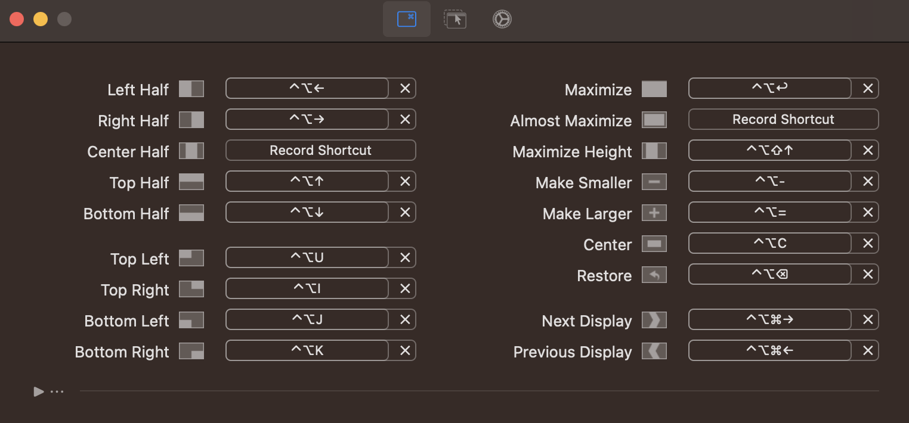</a>

**Note:** This functionality is built-in with macOS Sequoia, and it may be redundant to install Rectangle
#### Keyboard Shortcuts

* Change language - if you are using more than one language, you can add a keyboard shortcut for switching between them. Go to `System Preferences...` -> `keyboard` and select the shortcut tab. Under the `Input Sources` tick the `Select the previous input source option`:


**Note:** that you can modify the keyboard shortcut by clicking shortcut definition in that row

### Install Draw.io Desktop

The `drawio-desktop` is a desktop version of the [diagrams](https://www.diagrams.net/) app for creating diagrams and workflow charts. The desktop version, per the [project repository](https://github.com/jgraph/drawio-desktop), is designed to be completely isolated from the Internet, apart from the update process.


<p class='image-right'></a> Image credit: https://www.diagrams.net/</p>

To install the desktop version go to the [project repository](https://github.com/jgraph/drawio-desktop) and select the version you wish to install under the [releases](https://github.com/jgraph/drawio-desktop/releases) section:

</a>

For macOS users, once download the `dmp` file and open it, move the build to the applications folder:

</a>

### Resources

- Draw.io documentation - https://www.diagrams.net/
- drawio-desktop repository - https://github.com/jgraph/drawio-desktop
- Online version - https://app.diagrams.net/
