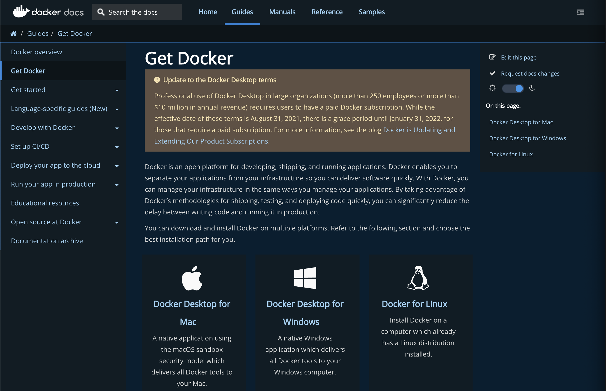

Hello 👋 

After setting/reinstalling a couple of machines from scratch in the last few months, I decided for once and for all to document my default data science setting and environment.

I am working with macOS Montarey but most of the tools in this document are OS agnostic (e.g., Windows, Linux, etc.).

💡 **A pro tip** 👉🏼 avoid dropping a cup of ☕️ on your machine 🤦🏻‍♂️

This document covers:
- [Setting Git and SSH](https://github.com/RamiKrispin/awesome-ds-setting/blob/main/README.md#setting-git-and-ssh)
- [Install Command Lines Tools](https://github.com/RamiKrispin/awesome-ds-setting/blob/main/README.md#install-command-lines-tools)
- [Install Docker](https://github.com/RamiKrispin/awesome-ds-setting/blob/main/README.md#install-docker)
- [Setting Terminal](https://github.com/RamiKrispin/awesome-ds-setting#terminal-setting)
- [Install R and RStudio](https://github.com/RamiKrispin/awesome-ds-setting/blob/main/README.md#install-r-and-rstudio)
- [Shortcuts](https://github.com/RamiKrispin/awesome-ds-setting/blob/main/README.md#shortcuts)
- [Setting Postgres](https://github.com/RamiKrispin/awesome-ds-setting#setting-postgres)


### Setting Git and SSH

Initial setting for Git

Source: https://git-scm.com/book/en/v2/Getting-Started-First-Time-Git-Setup


**Note:** you may have to install `command line developer tools`, if it is not already installed on your machine, it will pop-up the following option, and you will have to install it:


#### Set Git global options
##### Set users

``` shell
git config --global user.name "RamiKrispin"
git config --global user.email myemail@example.com
```

##### Set default branch name

The `init.defaultBranch` argument set the default branch name when running `git init`:

``` shell
git config --global init.defaultBranch main
```

##### Set global Git ignore file

Setting a global `gitignore` file will enable you to set general ignore roles that will apply to all the repositories in your machine.

``` shell
touch ~/.gitignore
git config --global core.excludesFile ~/.gitignore
```

Once the global Git ignore file is set, you just need to update the files you wish Git to ignore across all your local repositories. For example, the following will add `.DS_Store` to the global ignroe list:

``` shell 
echo .DS_Store >> ~/.gitignore
```

##### Set default editor

Git enables you to set the default shell code editor to create and edit your commit and tag messages with the `core.editor` argument:

``` shell
git config --global core.editor "vim"
```

#### Set SSH

Setting `SSH` key required to sync your local git repositories with the `origin`. To set SSH key on your local machine you need to use `ssh-keyget`:

``` shell
ssh-keygen -t ed25519 -C "YOUR_EAMIL@example.com"
```

Note that `-t` argument enable you to define the type of algorithm for authentication key, in this case I used `ed25519` and the `-C` argument used to add comment,in this case the user name email.

You will have to enter the file name for the SSH key, by default it will save it under the `~/.ssh` folder. 

**Note:** this process will generate two files:
- `your_ssh_key` is the private key, you should not expose it
- `your_ssh_key.pub` is the public key which will be used to to set the SSH on Github

The next step is to register the key on your Github account. Under setting select on the main menu `SSH and GPG keys` and click on the `New SSH key`:


And then, set the key name and paste the public key inside the key box:


Next step is to update the `config` file on the `~/.ssh` folder. You can edit the `config` file with `vim`:

``` shell
vim ~/.ssh/config 
```

and add somewhere on the file the following code:

``` shell
Host *
  AddKeysToAgent yes
  UseKeychain yes
  IdentityFile ~/.ssh/your_ssh_key
```
Where `your_ssh_key` is the private key file name


Last, run the following to load the key:
```
ssh-add -K ~/.ssh/your_ssh_key
```

#### Resources

- Github documentation - https://docs.github.com/en/enterprise-server@3.0/authentication/connecting-to-github-with-ssh/adding-a-new-ssh-key-to-your-github-account
- `ssh-keyget` arguments -  https://www.ssh.com/academy/ssh/keygen
- A great video toturial about setting SSH:  https://www.youtube.com/watch?v=RGOj5yH7evk&t=1230s&ab_channel=freeCodeCamp.org
- Setting Git ignore - https://www.atlassian.com/git/tutorials/saving-changes/gitignore

### Install Command Lines Tools

This section covers core command lines tools.

#### Homebrew

The Homebrew (or `brew`) enables you to install CL packages and tools for Mac. To install `brew` run from the terminal:

```shell
/bin/bash -c "$(curl -fsSL https://raw.githubusercontent.com/Homebrew/install/HEAD/install.sh)"
```

More info available: https://brew.sh/

#### jq

The `jq` is a lightweight and flexible command-line JSON processor. You can install it with `brew`:

```shell
brew install jq
```

### Install Docker

There are multiple ways to spin a VM locally to run Docker. I typically use [Docker Desktop](https://www.docker.com/products/docker-desktop), and for learning purposes (e.g., Kubernetes) I also install [Minikube](https://minikube.sigs.k8s.io/docs/).

#### Install Docker Desktop

Go to [Docker website](https://docs.docker.com/get-docker/) and follow the intallation instractions according to your OS:

</a>

#### Install Minikube

Minikube enables you to set virtual environment to run Docker. This is mainly relevant if you are using macOS or Windows and want to run Docker via cli. To install Minikube you will need to install first [kubectl](https://kubernetes.io/docs/reference/kubectl/overview/), [hyperkit](https://github.com/moby/hyperkit). We will use `brew` to install all those components:

``` shell
brew install kubectl
brew install hyperkit
brew install docker
brew install minikube
```

Lunching minikube with the `start` argument and setting the memory and cpu allocation:

``` shell
> minikube start --memory 4096 --cpus 2 --driver hyperkit
😄  minikube v1.24.0 on Darwin 12.0.1
    ▪ MINIKUBE_ACTIVE_DOCKERD=minikube
✨  Using the hyperkit driver based on user configuration
👍  Starting control plane node minikube in cluster minikube
🔥  Creating hyperkit VM (CPUs=2, Memory=4096MB, Disk=20000MB) ...
🐳  Preparing Kubernetes v1.22.3 on Docker 20.10.8 ...
    ▪ Generating certificates and keys ...
    ▪ Booting up control plane ...
    ▪ Configuring RBAC rules ...
🔎  Verifying Kubernetes components...
    ▪ Using image gcr.io/k8s-minikube/storage-provisioner:v5
🌟  Enabled addons: storage-provisioner, default-storageclass
🏄  Done! kubectl is now configured to use "minikube" cluster and "default" namespace by default
```

Lunch Docker:

``` shell
eval $(minikube -p minikube docker-env)
```

Check the Docker status:
``` shell
> docker info
Client:
 Context:    default
 Debug Mode: false

Server:
 Containers: 15
  Running: 14
  Paused: 0
  Stopped: 1
 Images: 10
 Server Version: 20.10.8
 Storage Driver: overlay2
  Backing Filesystem: extfs
  Supports d_type: true
  Native Overlay Diff: true
  userxattr: false
 Logging Driver: json-file
 Cgroup Driver: systemd
 Cgroup Version: 1
 Plugins:
  Volume: local
  Network: bridge host ipvlan macvlan null overlay
  Log: awslogs fluentd gcplogs gelf journald json-file local logentries splunk syslog
 Swarm: inactive
 Runtimes: io.containerd.runc.v2 io.containerd.runtime.v1.linux runc
 Default Runtime: runc
 Init Binary: docker-init
 containerd version: e25210fe30a0a703442421b0f60afac609f950a3
 runc version: 4144b63817ebcc5b358fc2c8ef95f7cddd709aa7
 init version: de40ad0
 Security Options:
  seccomp
   Profile: default
 Kernel Version: 4.19.202
 Operating System: Buildroot 2021.02.4
 OSType: linux
 Architecture: x86_64
 CPUs: 2
 Total Memory: 3.847GiB
 Name: minikube
 ID: 2IME:DJBF:L32S:HA4Q:DFCX:2LRI:JBCQ:6ORQ:RHUE:Q4S6:7WYE:PUD7
 Docker Root Dir: /var/lib/docker
 Debug Mode: false
 Registry: https://index.docker.io/v1/
 Labels:
  provider=hyperkit
 Experimental: false
 Live Restore Enabled: false
 Product License: Community Engine
```


#### Resources 
- Minikube documentation - https://minikube.sigs.k8s.io/docs/start/
- Installation guide - https://www.youtube.com/watch?v=zwmjzU62LWQ&ab_channel=AutomationStepbyStep
- Kubectl - https://kubernetes.io/docs/reference/kubectl/overview/
- hyperkit - https://github.com/moby/hyperkit

### Setting Terminal 

This section focuses on installing and setting tools for working on the terminal. 

#### Install iTerm2

The `terminal` is the built-in emulator on mac. I personally love to work with `iTerm2` as it provides additional functionality and customization options. iTerm2 is available only for mac, and can be installed directly from the [iTerm2](https://iterm2.com/) website or via `homebrew`:

``` shell
> brew cask install iterm2
.
.
.
==> Installing Cask iterm2
==> Moving App 'iTerm.app' to '/Applications/iTerm.app'
🍺  iterm2 was successfully installed!
```

#### Install zsh

The next step is to install Z shell or `zsh`. The `zsh` is shell flavor built on top of `bash`, providing a variety of add-in tools on the terminal. We will use `homebrew` again to install `zsh`:

``` shell
> brew install zsh
.
.
.
==> Installing zsh
==> Pouring zsh--5.8_1.monterey.bottle.tar.gz
🍺  /usr/local/Cellar/zsh/5.8_1: 1,531 files, 14.7MB
```

#### Install and Set Oh-My-Zsh

After installing the `zsh` we will install `oh-my-zsh`, an open-source framework for managing `zsh` configuration. We wiil install it with the `curl` command:

``` shell
 sh -c "$(curl -fsSL https://raw.github.com/ohmyzsh/ohmyzsh/master/tools/install.sh)"
```

You can note that your terminal view changed (you may need to reset your terminal to see the changes) and the default command line cursor looks like:

``` zsh
➜  ~
```

The default setting of `Oh My Zsh` stored on `~/.zshrc` and you can modify the default theme by editing the file:

```
vim ~/.zshrc
```

I use the `powerlevel10k` which can be install by cloning the Github repository:

``` zsh
git clone --depth=1 https://github.com/romkatv/powerlevel10k.git

And then change the theme setting on the `~/.zshrc` by `ZSH_THEME="powerlevel10k/powerlevel10k"`. After restarting the terminal, and reopening it you will a sequence of questions on that enables you to set the theme setting:

``` zsh

                            Install Meslo Nerd Font?

(y)  Yes (recommended).

(n)  No. Use the current font.

(q)  Quit and do nothing.

Choice [ynq]:
```

**Note:** the `Meslo Nerd` font is required to display symbles that is being used by the  `powerlevel10k` theme

You can always modify your selection by using:

``` zsh
 p10k configure
 ```
 
 The terminal after adding the `powerlevel10k` theme looks like:
 
 </a>

Installing `zsh-syntax-highlighting` to add code highlight on the terminal:

``` zsh
brew install zsh-syntax-highlighting
```

After the installation is done you will need to clone the source code. I set the destination as home folder, defining the traget folder hidden:

``` zsh
git clone https://github.com/zsh-users/zsh-syntax-highlighting.git $HOME/.zsh-syntax-highlighting
echo "source $HOME/.zsh-syntax-highlighting/zsh-syntax-highlighting.zsh" >> ${ZDOTDIR:-$HOME}/.zshrc
```

Once you reset your terminal, you should see be able to see the syntex highlight in green (in my case):

</a>


#### Resources
- `iTerm2` - https://iterm2.com/index.html
- `oh my zsh` - https://ohmyz.sh/
- freeCodeCamp blog post - https://www.freecodecamp.org/news/how-to-configure-your-macos-terminal-with-zsh-like-a-pro-c0ab3f3c1156/
- `powerlevel10k` theme - https://github.com/romkatv/powerlevel10k
- `zsh-syntax-highlighting` - https://github.com/zsh-users/zsh-syntax-highlighting/blob/master/INSTALL.md#in-your-zshrc

### Install R and RStudio

To set in your machine R and RStudio you should start first with installing R from CRAN. Go to https://cran.r-project.org/ and select `Download R for macOS` and select the release you wish to install and download. Once you finish to download the build you select open the `pkg` fild and start to install it:


**Note:** Older releases available on [CRAN Archive](https://cran-archive.r-project.org/bin/macosx/).

Once R installed, you can install RStudio - go to https://www.rstudio.com/products/rstudio/download/ and select the version and download it:


Once finish to download it move the application into the Application folder.

#### Set RStudio

- Workspace - select `Never` to `Save workspace to .RData on exit` option
- History - go to `Tools` -> `Global Option` -> `General` and untick the first options - `Always save history...`. This will avoid saving the session on quit.
- Code: 
  - Code snippet - go to `Tools` -> `Global Option` -> `Code`, on the Snippet menue tick the `Enable code snippets` option and select `Edit Snippets` button to edit your snippits. My default snippets available [here](https://gist.github.com/RamiKrispin/b16b63688746c4cfd01ec21cc7c25d2a).
  - Rainbow parentheses 🌈 - `Tools` -> `Global Option` -> `Code`, select the `Display` tab and tick the `Rainbow parentheses` box.
- Appearance - go to `Tools` -> `Global Option` -> `Appearance` and select the font type and size, and editor theme (Merbivore Soft):


#### RStudio main shortcuts

- Clear console - `Ctrl` +  `L`
- Clost current document - `Cmd` + `W`
- Move focus to the Source panel - `Cmd` + `1`
- Move focus to the Console panel - `Cmd` + `2`
- Move tab left - `Cmd` + `]`
- Move tab right - `Cmd` + `[`
- Move tab to first - `Cmd` + `P`
- Move tab to last - `Cmd` + `\`
- New Rmarkdown notebook - `Cmd` + `R`

#### Install XQuartz

The XQuartz is an open-source project that provides required for graphic applications (X11) for macOS (similar to the X.Org X Window System functionality). To install it go to https://www.xquartz.org/ - download and install it.

#### Install Orca

Orca is application for transferring plotly graphs into images. To install the app on macOS:

- Go to the project [Github page](https://github.com/plotly/orca) and download the most recent [release](https://github.com/plotly/orca/releases) (i.e., `mac-release.zip`)
- Unzip the `mac-release.zip` file.
- Double-click on the `orca-X.Y.Z.dmg` file. This will open an installation window.
- Drag the orca icon into the Applications folder.
- Open finder and navigate to the Applications/ folder.
- Right-click on the orca icon and select Open from the context menu.
- A password dialog will appear asking for permission to add orca to your system `PATH`.
- Enter you password and click OK.
- This should open an Installation Succeeded window.
- Open a new terminal and verify that the orca executable is available on your PATH.

``` shell
> which orca
/usr/local/bin/orca
```

**Resources**
- https://github.com/plotly/orca/releases
- https://plotly.com/r/static-image-export/


### Installing Julia

To install Julia, go to https://julialang.org/downloads/ to download the current stable version of Julia or older releases. On Mac, the next step after moving the `dmg` file to the **Applications** folder, is to add Julia to PATH:

``` shell
sudo mkdir -p /usr/local/bin
sudo rm -f /usr/local/bin/julia
sudo ln -s /Applications/Julia-1.7.app/Contents/Resources/julia/bin/julia /usr/local/bin/julia

```

**Note:** That the Julia version on the code above should aligned with the one installed on your local machine. More info avilable [here](https://julialang.org/downloads/platform/#macos).


#### Setting Julia with VScode

WIP


### Setting Python

This section focuses on setting up a Python environment.

#### Installing miniconda

Miniconda is a great tool to set local Python environments. Go to the Miniconda installer [page](https://docs.conda.io/en/latest/miniconda.html#latest-miniconda-installer-links) and download the installing package based on your operating system and Python version to install the most recent version. Once Miniconda installed you can install Python packaes with `conda`:

``` shell
conda install pandas
```

Likewise, you can use `conda` to create an environment:

```
conda create -n myenv python
```

#### Common conda commands

Get a list of environments:

``` shell
conda info --envs
```

Create an environment and set the Python version:

```
conda create --name myenv python=3.9
```

Get package available versions:

```
conda search pandas
```

Activate an enviroment:

``` sheel
conda activate myenv
```

Get a list of installed packages in the environment:

``` shell
conda list
```

Deactivate the enviroment:

```shell
conda deactivate
```

### Shortcuts

This section covers the installation and setting of additional tools and features such as screen spliting, shortcuts, etc.

#### Spectacle

Spectacle is great tool for moving and resizing your windows. To install it go to https://www.spectacleapp.com/ and download it. Once installed you can modify the default setting:


**Note:** Once installed, don't forget to select the checkbox `Launch Spectacle at login` to keep the the app active after reseting/shoutdown your machine.

#### Keyboard Shortcuts

* Change language - if you are using more than one language, you can add a keyboard shortcut for switching between them. Go to `System Preferences...` -> `keyboard` and select the shortcut tab. Under the `Input Sources` tick the `Select the previous input source option`:


**Note:** that you can modify the keyboard shortcut by clicking shortcut definition in that row

### Setting Postgres

PostgreSQL supprts most of the common OS such as Windows, macOS, Linux, etc.

To download go to Postgres project [website](https://www.postgresql.org/) and navigate to the **Downlaod** tab and select your OS, which will naviage it to the OS download page, and follow the instraction:

 [</a>](https://www.postgresql.org/download/)


On mac I highly recommand to install PostgreSQL through the [Postgres.app](https://postgresapp.com/):

 [</a>](https://postgresapp.com/)


When opening the app, you should have a default server set to port 5432 (make sure that this port is available):

</a>

To launch the server click on the `start` button:

</a>

By default, the server will create three databases - `postgres`, `YOUR_USER_NAME`, and `template1`. You can add additional server (or remove) by clicking the `+` or `-` symbols on the left botton.


To run Postgres from the terminal you will have to set define the path of the app on your `zshrc` file (on mac) by adding the following line:

``` zsh
export PATH=$PATH:/Applications/Postgres.app/Contents/Versions/14/bin/
```

Where `/Applications/Postgres.app/Contents/Versions/14/bin/` is the local path on my machine.

Alternativly, you can set the alias from the terminal by running the following"


``` zsh
echo "export PATH=$PATH:/Applications/Postgres.app/Contents/Versions/14/bin/" >> ${ZDOTDIR:-$HOME}/.zshrc
```


#### Clear port

If the port you set for the Postgres server is in use you should expect to get the following message when trying to start the server:

</a>

This mean that the port is either used by other Postgres server or other application. To check what ports in use and by which applications you can use the `lsof` function on the terimnal:

``` zsh
sudo lsof -i :5432                                                                                           COMMAND  PID     USER   FD   TYPE             DEVICE SIZE/OFF NODE NAME
postgres 124 postgres    7u  IPv6 0xc250a5ea155736fb      0t0  TCP *:postgresql (LISTEN)
postgres 124 postgres    8u  IPv4 0xc250a5ea164aa3b3      0t0  TCP *:postgresql (LISTEN)
```

Where the `i` argument enables to search by port number, in the example above by `5432`. As can see from the output, the port is used by other Posrgres server. You can clear the port by using the `pkill` command:

``` zsh
sudo pkill -u postgres
```

Where the `u` arugment enbales to define the port you want to clear by the USER field, in this case `postgres`.

**Note:** Before you are clearing the port, make sure you do not need the applications on that port. 

### Resources
* **Tutrial -** https://www.youtube.com/watch?v=qw--VYLpxG4&t=1073s&ab_channel=freeCodeCamp.org
* **PostgreSQL -** https://en.wikipedia.org/wiki/PostgreSQL
* **Documentation -** https://www.postgresql.org/docs/


## Installing Draw.io Desktop

The `drawio-desktop` is a desktop version of the [diagrams](https://www.diagrams.net/) app for creating diagrams and workflow charts. The desktop version, per the [project repository](https://github.com/jgraph/drawio-desktop), is designed to be completely isolated from the Internet, apart from the update process.


<p class='image-right'></a> Image credit: https://www.diagrams.net/</p>

To install the desktop version go to the [project repository](https://github.com/jgraph/drawio-desktop) and select the version you wish to install under the [releases](https://github.com/jgraph/drawio-desktop/releases) section:

</a>

For macOS users, once download the `dmp` file and open it, move the build to the applications folder:

</a>

### Resources

* **Draw.io documentation -** https://www.diagrams.net/
* **drawio-desktop repository -** https://github.com/jgraph/drawio-desktop
* **Online version -** https://app.diagrams.net/
